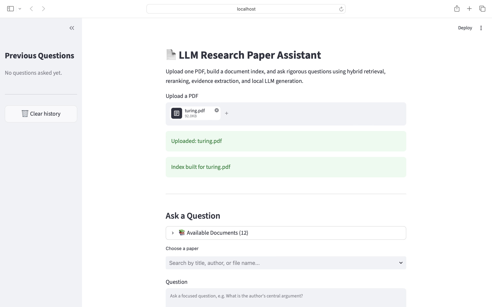
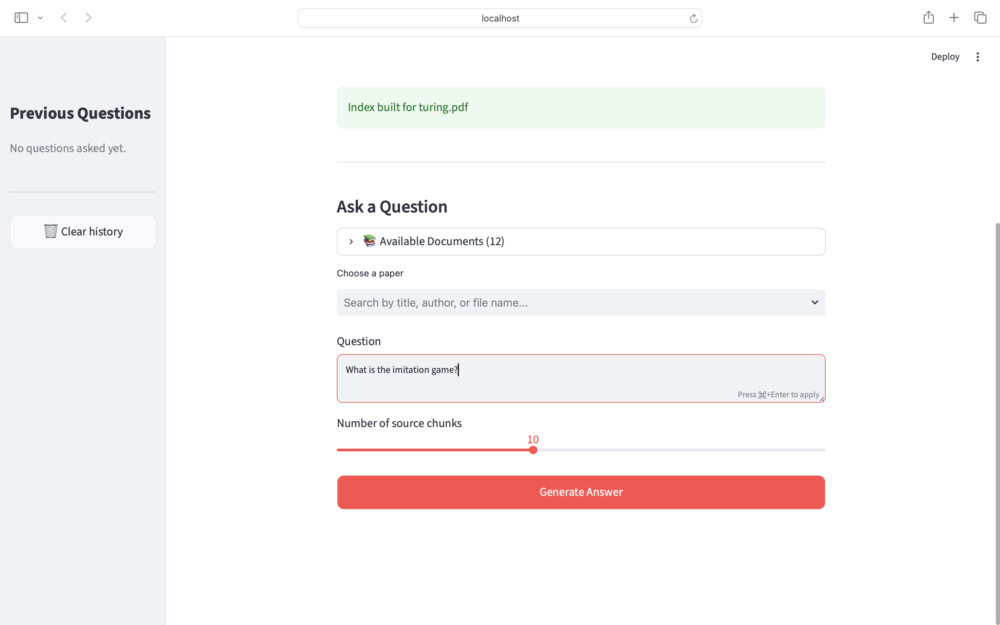
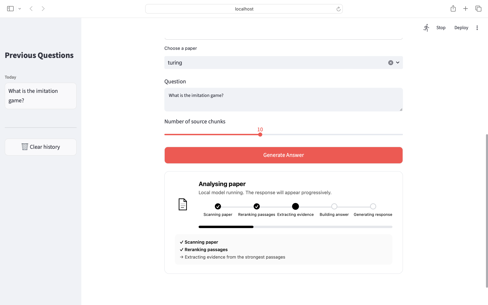
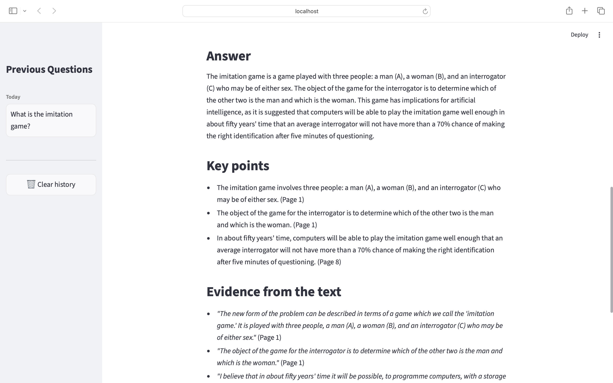
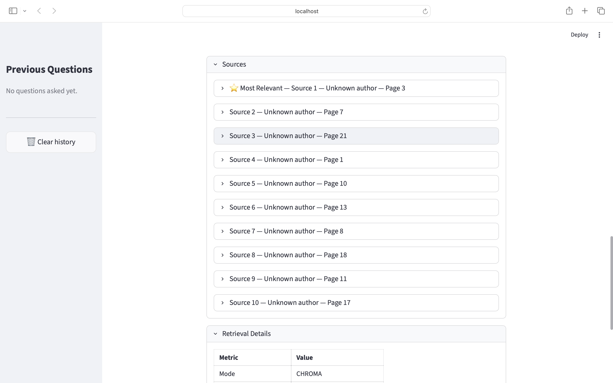

# 📄 LLM Research Assistant

> A local-first Retrieval-Augmented Generation (RAG) system that answers questions about research papers using adaptive retrieval, dense vector search, passage reranking, evidence extraction, and optional live web search.


---


A modular Retrieval-Augmented Generation (RAG) system that answers questions about research papers using hybrid retrieval, cross-encoder reranking, evidence-aware prompting, and local large language models.

Unlike many demonstration RAG projects that simply retrieve the nearest text chunks before prompting a language model, this project implements a multi-stage retrieval pipeline designed to improve retrieval quality, transparency, and answer grounding. It combines dense semantic search, lexical retrieval, passage reranking, query-aware retrieval routing, evidence extraction, and local inference into a single application with an interactive Streamlit interface.

The project was developed as part of my AI engineering portfolio to explore how modern Retrieval-Augmented Generation systems can be engineered without relying on high-level orchestration frameworks. Rather than treating retrieval as a black box, the implementation separates each stage into independent components that can be evaluated, replaced, and improved individually.

---

## Demo

The screenshots below illustrate the complete workflow of the application.

### Upload Research Paper



---

### Ask Questions



---

### Retrieval Progress



---

### Generated Answer



---

### Generated Answer with Citations



---

# About the Project

Large language models cannot reliably answer questions about documents they have never seen. Standard Retrieval-Augmented Generation (RAG) systems address this limitation by retrieving relevant passages from external documents and providing those passages as context to the language model before answer generation.

While basic RAG pipelines work well for many use cases, they also introduce several practical engineering challenges:

- semantic retrieval may miss exact terminology
- keyword retrieval may miss conceptual similarity
- retrieved chunks are often noisy
- language models may over-rely on weak evidence
- retrieval quality is difficult to inspect
- users rarely know how an answer was produced

This project investigates those challenges by implementing a modular retrieval pipeline rather than relying on an end-to-end framework.

The application performs document ingestion, indexing, retrieval, reranking, evidence extraction, prompt construction, and local answer generation as independent stages. This separation makes each component easier to evaluate, replace, and improve while providing greater transparency during inference.

Rather than optimising solely for answer generation, the project focuses on retrieval quality, engineering modularity, and explainability.

---

# Key Engineering Highlights

Compared with a basic RAG implementation, this project introduces several engineering improvements.

- Hybrid retrieval combining dense semantic search with lexical retrieval.
- Cross-encoder reranking to improve passage relevance before generation.
- Query-aware retrieval routing that dynamically decides whether uploaded documents alone are sufficient or whether external web search should also be performed.
- Evidence-aware prompting that encourages grounded responses supported by retrieved passages.
- Citation-aware answer generation using document page references.
- Modular architecture where retrieval, reranking, prompting, indexing, and generation remain independent components.
- Local inference through Ollama without dependence on commercial APIs.
- Interactive Streamlit interface showing retrieval progress and previous questions.

The objective was not simply to produce correct answers, but to make the retrieval process observable and easy to extend.

---

# System Architecture

The overall system follows a modular Retrieval-Augmented Generation pipeline.

```

                 PDF Upload
                      │
                      ▼
              Document Loader
                      │
                      ▼
                 Text Chunking
                      │
                      ▼
             Embedding Generation
                      │
                      ▼
                 FAISS Index
                      │
          ┌───────────┴───────────┐
          │                       │
          ▼                       ▼
   Dense Retrieval          BM25 Retrieval
          │                       │
          └───────────┬───────────┘
                      ▼
            Hybrid Candidate Set
                      │
                      ▼
        Cross Encoder Reranking
                      │
                      ▼
          Evidence Selection
                      │
                      ▼
        Prompt Construction
                      │
                      ▼
            Ollama Local LLM
                      │
                      ▼
       Grounded Answer + Citations

```

Each stage is implemented independently within the codebase, making the retrieval pipeline significantly easier to inspect and modify than other RAG implementations.

This modular design also makes experimentation straightforward. Individual retrieval methods, embedding models, rerankers, or language models can be replaced without rewriting the remainder of the system.

---
# Engineering Decisions

One of the primary goals of this project was to understand how modern Retrieval-Augmented Generation systems are engineered internally rather than relying on high-level orchestration libraries.

Instead of building the application around frameworks such as LangChain or LlamaIndex, the retrieval pipeline was implemented using modular Python components. This provides complete control over indexing, retrieval, reranking, prompt construction, and generation while making individual stages easier to evaluate and replace.

The project intentionally prioritises transparency over abstraction.

---

## Why a Custom Retrieval Pipeline?

Many RAG tutorials hide most of the retrieval process behind a framework.

Although this accelerates development, it also makes it difficult to understand:

- where retrieval quality is lost
- why irrelevant passages are selected
- how reranking affects final answers
- which component contributes most to latency
- how retrieval strategies can be compared

Instead, this project separates the pipeline into individual modules so every stage can be inspected independently.

Advantages of this approach include:

- easier debugging
- clearer code organisation
- simpler experimentation
- component-level testing
- straightforward model replacement
- reduced framework lock-in

---

## Why Hybrid Retrieval?

Dense semantic retrieval performs well when queries use language that is conceptually similar to the source document.

However, research papers frequently contain:

- acronyms
- equations
- gene names
- chemical compounds
- technical terminology
- author-specific vocabulary

Dense retrieval alone may overlook these exact matches.

Conversely, lexical retrieval methods such as BM25 excel at finding precise keyword matches but often miss semantically related passages.

Rather than choosing one retrieval strategy, this project combines both.

The retrieval process therefore consists of:

1. Dense vector search using FAISS.
2. Lexical retrieval using BM25.
3. Candidate merging.
4. Cross-encoder reranking.

This hybrid strategy increases the likelihood that both semantic and exact-match evidence are available for answer generation.

---

## Why Cross-Encoder Reranking?

Initial retrieval often returns passages that are individually relevant but not necessarily the best evidence for answering a particular question.

To improve passage quality, the candidate set is reranked using a cross-encoder.

Unlike embedding similarity, which compares vector representations independently, the cross-encoder jointly evaluates both the user query and each candidate passage.

This generally produces a more accurate relevance score because the model considers the interaction between both pieces of text simultaneously.

Only the highest-ranked passages are forwarded to the language model.

Benefits include:

- reduced irrelevant context
- improved evidence quality
- more focused prompts
- better citation accuracy

Although reranking introduces additional latency, the improvement in passage relevance makes the trade-off worthwhile for research-oriented question answering.

---

## Why Local Language Models?

The application performs answer generation locally using Ollama.

This design was chosen for several reasons.

### Privacy

Research papers may contain unpublished work or sensitive material.

Keeping inference local avoids transmitting documents to external APIs.

### Cost

Running inference locally eliminates ongoing API costs and enables unrestricted experimentation.

### Flexibility

Different language models can be evaluated without modifying the remainder of the retrieval pipeline.

### Reproducibility

Using local models allows experiments to be reproduced consistently without depending on changing commercial APIs.

---

# Models and Libraries Used

| Component | Model / Library | Purpose |
|-----------|-----------------|---------|
| Embedding Model | `all-MiniLM-L6-v2` via Sentence Transformers | Dense semantic embeddings |
| Vector Index | FAISS `IndexFlatIP` | Inner-product similarity search over normalised embeddings |
| Lexical Retrieval | `rank-bm25` | BM25 keyword retrieval |
| Reranker | `cross-encoder/ms-marco-MiniLM-L-6-v2` | Cross-encoder passage reranking |
| Inference Engine | Ollama | Local LLM serving |
| Language Model | `llama3.1:8b` | Answer generation |
| PDF Processing | PyMuPDF | Research paper parsing |
| Web Search | Tavily API | Optional live web retrieval |
| Interface | Streamlit | Web application |
| Storage | joblib | Saving chunk metadata and retrieval objects |

---

# Project Structure

```

LLM-Research-Assistant/

├── app/
│ └── streamlit_app.py
│
├── data/
│ ├── documents/
│ ├── faiss_index/
│ └── processed/
│
├── docs/
│ └── images/
│
├── src/
│ ├── adaptive_retrieval.py
│ ├── chunker.py
│ ├── embeddings.py
│ ├── index_builder.py
│ ├── ollama_client.py
│ ├── pdf_loader.py
│ ├── qa_engine.py
│ ├── query_planner.py
│ ├── reranker.py
│ ├── retriever.py
│ ├── vector_store.py
│ └── web_search.py
│
├── tests/
│
├── requirements.txt
└── README.md

```

The repository follows a modular architecture in which each stage of the retrieval pipeline is implemented independently.

This organisation allows new retrieval strategies, embedding models, rerankers, or language models to be integrated with minimal changes to the surrounding code.

---
# Retrieval Pipeline

The application separates retrieval into several independent stages. Rather than treating retrieval as a single operation, each stage performs a specific task before passing structured information to the next component.

```
User Question
      │
      ▼
Query Planning
      │
      ▼
Hybrid Retrieval
      │
      ▼
Cross Encoder Reranking
      │
      ▼
Evidence Selection
      │
      ▼
Prompt Construction
      │
      ▼
Local LLM
      │
      ▼
Grounded Response
```

This modular design makes the retrieval pipeline significantly easier to evaluate and extend than a monolithic implementation.

---

# Document Processing

When a PDF is uploaded through the Streamlit interface, the application automatically performs the following steps.

1. Parse the document.
2. Extract textual content.
3. Divide the text into overlapping chunks.
4. Generate embeddings.
5. Build a FAISS index.
6. Store document metadata.
7. Prepare BM25 retrieval structures.

The indexing process only occurs once for each uploaded document.

Subsequent questions reuse the generated index, allowing retrieval to remain fast even after many queries.

---

# Chunking Strategy

Large language models cannot process entire research papers efficiently.

Instead, each paper is divided into overlapping chunks.

Each chunk stores metadata including:

- document name
- page number
- section
- chunk identifier
- extracted text

The overlap between adjacent chunks reduces the chance that important information is split across chunk boundaries.

This metadata later allows generated answers to reference the original source pages.

---

# Hybrid Retrieval

The retriever combines two complementary search strategies.

## Semantic Retrieval

Every chunk embedding is stored within a FAISS index.

When a question is asked:

1. The question is embedded.
2. FAISS retrieves the nearest neighbouring chunks.
3. Candidate passages are returned.

Semantic retrieval performs well when similar concepts are expressed using different wording.

---

## BM25 Retrieval

In parallel, BM25 performs lexical retrieval.

This improves retrieval for:

- names
- abbreviations
- technical terminology
- equations
- exact phrases

Rather than replacing semantic retrieval, BM25 provides an additional set of candidate passages.

---

## Candidate Merging

The outputs of both retrieval methods are merged before reranking.

This increases retrieval coverage while reducing the likelihood that useful passages are discarded too early.

---

# Query-Aware Retrieval Routing

Not every question should be answered using the uploaded document alone.

Before retrieval begins, the application performs lightweight routing to determine which knowledge source is most appropriate.

Current routes include:

| Route | Behaviour |
|--------|-----------|
| CHROMA | Retrieve information from uploaded documents |
| WEB | Retrieve information from live web search |
| BOTH | Combine uploaded documents with web search |

Routing is currently implemented using rule-based query classification.

For example,

```
What does this paper conclude?
```

retrieves only from the uploaded document.

Whereas,

```
What is the latest research on Retrieval-Augmented Generation?
```

is automatically routed to web search.

This prevents unnecessary retrieval from unrelated documents while allowing the assistant to answer broader questions.

---

# Cross Encoder Reranking

Hybrid retrieval intentionally favours recall.

Consequently, some retrieved passages may only be loosely related to the user's question.

To improve precision, candidate passages are reranked before answer generation.

Only the highest scoring passages are retained.

This additional stage improves context quality while reducing prompt length.

---

# Evidence Selection

The reranked passages are converted into structured evidence before being passed to the language model.

Rather than sending every retrieved chunk directly to the LLM, the system extracts the information most relevant to the user's question.

The prompt therefore contains:

- relevant passages
- page numbers
- document metadata
- supporting evidence

This encourages answers to remain grounded in retrieved sources.

---

# Prompt Construction

Prompt generation is separated from retrieval.

The prompt builder combines:

- user question
- retrieved evidence
- metadata
- citation information

into a structured prompt before generation.

Separating prompt construction from retrieval makes prompt engineering independent of retrieval logic and simplifies future experimentation.

---

# Local Answer Generation

Once evidence has been prepared, the prompt is forwarded to a local Ollama model.

The language model is responsible for:

- synthesising retrieved evidence
- generating fluent explanations
- producing readable answers
- preserving citations

The retrieval system is responsible for factual grounding.

The language model is responsible for explanation.

Keeping these responsibilities separate makes the behaviour of the system considerably easier to understand and debug.

---

# Web Search Integration

The project optionally supports live web retrieval using the Tavily Search API.

When a query is classified as requiring external information:

```
Question

↓

Route Classifier

↓

Tavily Search

↓

Result Processing

↓

Evidence Selection

↓

Local LLM
```

Web search extends the assistant beyond uploaded documents while still allowing responses to be grounded in retrieved sources.

This makes it possible to answer questions about recent developments that would not exist within the uploaded paper.

---

# Streamlit Interface

The user interface was designed to expose retrieval behaviour rather than hiding it.

Current functionality includes:

- PDF upload
- automatic indexing
- configurable retrieval depth
- adaptive routing
- retrieval diagnostics
- previous question history
- downloadable answers
- source inspection
- citation display

The interface also visualises retrieval progress, allowing users to observe which stage of the pipeline is currently executing.

This transparency makes the application feel more responsive while providing insight into how answers are produced.

# Evaluation

The retrieval pipeline was designed so that individual components can be evaluated independently rather than treating answer quality as a single end-to-end metric.

Because retrieval and generation are separated, improvements to one stage can be measured without modifying the remainder of the system.

The evaluation framework focuses on three aspects:

- retrieval quality
- system performance
- engineering trade-offs

---

## Retrieval Quality

The retrieval pipeline can be evaluated using standard Information Retrieval metrics.

| Metric | Purpose |
|----------|----------|
| Recall@k | Measures whether relevant passages appear in the retrieved candidate set. |
| Mean Reciprocal Rank (MRR) | Measures how highly relevant passages are ranked. |
| Precision@k | Measures the proportion of retrieved passages that are relevant. |
| Citation Accuracy | Measures whether generated claims reference the correct supporting pages. |

These metrics make it possible to compare retrieval strategies objectively rather than relying solely on subjective answer quality.

---

## Performance

Typical system performance depends on

- document length
- chunk count
- embedding model
- reranking depth
- local hardware
- language model

Performance measurements are currently collected manually during development and will be expanded into an automated benchmark suite in future releases.

The benchmark was collected over **30 representative queries** consisting of both document retrieval and web-search requests.

### Overall latency

| Stage | Mean | Median | Min | Max | Std Dev |
|---|---:|---:|---:|---:|---:|
| Retrieval | 11.92s | 8.41s | 3.43s | 44.10s | 8.61s |
| Evidence extraction | 70.13s | 66.46s | 36.42s | 136.28s | 23.03s |
| Answer generation | 31.42s | 30.67s | 12.98s | 44.52s | 8.45s |
| Total response time | 113.47s | 110.01s | 68.57s | 187.16s | 30.30s |

Evidence extraction is the dominant contributor to total latency because the local LLM must process and summarise multiple retrieved passages before generating the final response. Retrieval itself contributes a relatively small proportion of the overall response time.

### Average latency by retrieval mode

| Mode | Runs | Avg Retrieval | Avg Evidence | Avg Generation | Avg Total |
|---|---:|---:|---:|---:|---:|
| CHROMA | 21 | 13.72s | 75.34s | 31.34s | 120.40s |
| WEB | 9 | 7.72s | 57.98s | 31.60s | 97.30s |

These results indicate that document retrieval generally requires more retrieval and evidence processing time than web search, primarily because larger sets of retrieved passages must be reranked and synthesised.

---

## Retrieval Configurations

One advantage of the modular architecture is that different retrieval strategies can be compared directly.

For example,

| Configuration | Recall@10 | MRR | Avg Retrieval Time |
|---------------|-----------|-----|--------------------|
| Dense Retrieval | — | — | — |
| Dense + BM25 | — | — | — |
| Hybrid + Reranker | — | — | — |

This makes it possible to evaluate whether additional retrieval complexity produces measurable improvements.

---

# Engineering Trade-offs

Modern RAG systems involve balancing retrieval quality, latency and implementation complexity.

Several design decisions required explicit trade-offs.

---

## Hybrid Retrieval

Advantages

- Better retrieval coverage
- Improved exact-match retrieval
- Stronger semantic search
- More robust across different document styles

Disadvantages

- More candidate passages
- Additional retrieval latency
- Increased implementation complexity

---

## Cross Encoder Reranking

Advantages

- Better passage ordering
- Higher quality evidence
- Reduced irrelevant context

Disadvantages

- Increased inference time
- Additional model dependency

For research-oriented question answering, improved retrieval quality was considered more valuable than minimal latency.

---

## Local Inference

Advantages

- Offline operation
- Privacy
- No API costs
- Full control over model selection

Disadvantages

- Slower than commercial hosted APIs
- Hardware dependent
- Larger local resource requirements

---

## Rule-Based Retrieval Routing

Advantages

- Fast
- Transparent
- Easy to modify
- Predictable behaviour

Disadvantages

- Limited flexibility
- Difficult to generalise
- Less robust than learned routing models

Future versions may replace this component with an LLM-based router.

---

# Failure Modes

Building the project highlighted several situations where retrieval quality becomes more difficult.

Examples include

- highly abbreviated technical papers
- scanned PDFs
- diagrams without accompanying text
- tables containing important numerical information
- questions requiring reasoning across multiple documents

Although these limitations are common to many document-grounded systems, they highlight opportunities for future improvement.

---

# Lessons Learned

Several engineering observations emerged during development.

## Retrieval quality matters more than model size

The largest improvements in answer quality came from improving retrieval rather than replacing the underlying language model.

Introducing

- hybrid retrieval
- reranking
- evidence-aware prompting

generally produced larger improvements than switching language models.

---

## Better retrieval reduces hallucination

Improving passage relevance consistently produced more reliable answers.

In many cases, stronger retrieval had a greater effect on factual accuracy than prompt engineering alone.

---

## Modular architectures simplify experimentation

Separating

- indexing
- retrieval
- reranking
- prompting
- generation

made it possible to improve individual components without rewriting the entire system.

This proved especially valuable as new retrieval methods were introduced during development.

---

## User experience matters

Retrieval systems often appear unresponsive while multiple models execute.

Adding retrieval progress visualisation significantly improved perceived responsiveness while making the retrieval pipeline easier to understand.

Although this feature does not improve answer quality directly, it substantially improves usability.

---

## Building RAG systems is primarily a retrieval problem

A recurring lesson throughout development was that modern Retrieval-Augmented Generation systems involve considerably more than prompt engineering.

Document parsing, chunking, indexing, retrieval, reranking and evidence selection collectively had a greater impact on final answer quality than prompt wording alone.

This project therefore treats retrieval and generation as separate engineering problems rather than a single language modelling task.

---
# Installation

## Prerequisites

Before running the project, install:

- Python 3.11 or later
- Git
- Ollama

If you plan to use live web retrieval, you will also need a free Tavily API key.

---

## 1. Clone the Repository

```bash
git clone https://github.com/Brxckfuller/LLM-Research-Assistant.git
cd LLM-Research-Assistant
```

---

## 2. Create a Virtual Environment

macOS / Linux

```bash
python3 -m venv .venv
source .venv/bin/activate
```

Windows

```bash
python -m venv .venv
.venv\Scripts\activate
```

---

## 3. Install Dependencies

```bash
pip install -r requirements.txt
```

---

## 4. Install Ollama

Download Ollama from

https://ollama.com

Start the local server

```bash
ollama serve
```

Pull the language model used by the project

```bash
ollama pull llama3.1
```

Replace the model name if you are using a different local model.

---

## 5. Configure Optional Web Search

Live web retrieval uses the Tavily Search API.

Create a `.env` file in the project root.

```text
TAVILY_API_KEY=your_api_key_here
```

Without this key the application still functions normally using document retrieval only.

---

## 6. Launch the Application

```bash
streamlit run app/streamlit_app.py
```

The Streamlit interface should automatically open in your browser.

---

# Usage

## Upload a Paper

Upload one or more research papers through the Streamlit interface.

The application automatically:

- extracts text
- chunks the document
- generates embeddings
- builds the FAISS index
- stores document metadata
- prepares lexical retrieval structures

No manual indexing is required.

---

## Ask Questions

Once indexing has completed, questions can be asked in natural language.

Examples

```
What is the main argument of this paper?

How was the experiment designed?

Summarise the methodology.

What evidence supports the conclusion?

What limitations do the authors discuss?
```

---

## Web Search

Questions requiring external knowledge automatically trigger live retrieval.

Examples

```
What is Retrieval-Augmented Generation?

What are the latest developments in GraphRAG?

Explain Agentic Retrieval.

Compare this paper with recent research.
```

The routing layer determines whether the uploaded document, live web search, or both should be used.

---

# Testing

Core functionality is tested using **pytest**.

Run the test suite with

```bash
pytest
```

Current tests cover

- document chunking
- retrieval behaviour
- indexing
- parser reliability
- reranking

As the project develops, testing will expand to include retrieval benchmarking and end-to-end integration tests.

---

# Reproducibility

The project has been designed so that the complete retrieval pipeline can be reproduced using only

- Python
- Ollama
- the supplied requirements
- a free Tavily API key (optional)

No commercial APIs are required for document question answering.

This allows experiments to be reproduced locally while keeping uploaded documents private.


---
# Current Limitations

Although the system performs well for document-grounded question answering, several limitations remain.

## OCR Support

The ingestion pipeline assumes uploaded PDFs contain machine-readable text.

Scanned documents and image-only PDFs currently require preprocessing before they can be indexed.

Potential future additions include:

- Tesseract OCR
- PaddleOCR
- Nougat for scientific documents

---

## Metadata Filtering

Retrieval is currently based primarily on semantic similarity and lexical matching.

Future versions could support filtering by metadata such as

- author
- publication year
- journal
- conference
- section
- document type

This would become increasingly valuable when working with large document collections.

---

## Multi-document Reasoning

Although multiple documents can be indexed simultaneously, retrieval is performed independently for each chunk.

The assistant does not yet perform explicit reasoning across multiple papers.

Possible future improvements include

- literature review generation
- contradiction detection
- consensus extraction
- cross-document summarisation

---

## Structured Content

The current pipeline focuses primarily on textual content.

Tables, equations and figures are not explicitly represented during retrieval.

Supporting structured document elements would improve question answering for scientific literature where important information is frequently presented outside the main body text.

---

# Future Work

Several improvements are planned as the project evolves.

## Retrieval Evaluation

The highest priority is implementing an automated evaluation pipeline.

This will measure

- Recall@k
- Precision@k
- Mean Reciprocal Rank
- retrieval latency
- citation accuracy

allowing retrieval strategies to be compared objectively.

---

## Metadata-Aware Retrieval

Future retrieval will incorporate document metadata alongside semantic similarity.

Potential filters include

- publication year
- author
- journal
- document section
- keywords

This would improve retrieval precision for larger collections.

---

## Improved Routing

The current retrieval router uses lightweight rule-based classification.

A future version may replace this with a learned routing model capable of reasoning about more ambiguous queries.

---

## Better Citation Support

Future work includes highlighting the exact supporting spans used to generate each claim.

This would improve transparency while making responses easier to verify against the original document.

---

## OCR Integration

Supporting scanned PDFs would significantly broaden the range of documents the assistant can analyse.

---

# Lessons Learned

Developing this project reinforced several observations about Retrieval-Augmented Generation systems.

## Retrieval quality matters more than model size

The largest improvements came from strengthening retrieval rather than replacing the underlying language model.

Adding

- hybrid retrieval
- reranking
- evidence-aware prompting

had a larger effect on answer quality than switching between comparable local language models.

---

## Better retrieval reduces hallucination

The reliability of generated answers depended primarily on the quality of retrieved evidence.

When irrelevant passages entered the prompt, answer quality consistently declined regardless of the language model.

---

## Modular systems are easier to improve

Separating

- indexing
- retrieval
- reranking
- prompting
- generation

allowed individual components to evolve independently.

This proved especially valuable as new retrieval strategies were introduced during development.

---

## User experience matters

Although retrieval quality is critical, presentation also affects usability.

Visualising retrieval progress and exposing supporting evidence made the system feel substantially more transparent than simply displaying a final answer.

---

# Why This Project?

Many Retrieval-Augmented Generation demonstrations focus primarily on connecting a vector database to a hosted language model.

The goal of this project was different.

Rather than producing the smallest possible implementation, I wanted to understand and build the engineering components that determine retrieval quality.

This led to implementing:

- modular retrieval components
- hybrid search
- reranking
- evidence-aware prompting
- retrieval diagnostics
- local inference
- adaptive routing
- citation-aware responses

The resulting system is intended as a practical exploration of how modern document-grounded AI assistants are engineered rather than simply wrapping an LLM with a vector database.

---


# Author

Developed by **Brock Fuller** as part of an AI engineering portfolio focused on Retrieval-Augmented Generation, information retrieval, and applied machine learning.

GitHub:

https://github.com/Brxckfuller

LinkedIn:

www.linkedin.com/in/brock-fuller-8497593a0

---


